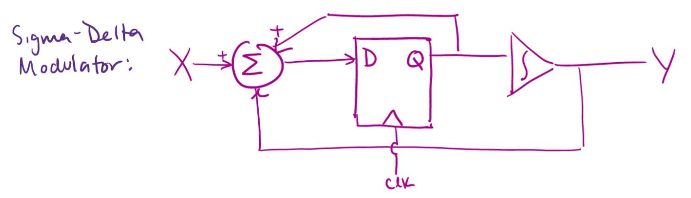

# FPGA_SIGDEL_DAC
A SystemVerilog implementation of a simple sigma-delta digital-to-analog converter (DAC).

Max Stopyra, Andrew DeCandia, Andrew Phillips, Shamama Sirroon

## Overview
This project contains an implementation of a sigma-delta DAC written in SystemVerilog for an FPGA. A delta-sigma modulator accumulates (sigma) the difference (delta) between the input signal and the measured current combined at the summing junction of the circuit. Delta-sigma DACs excel in audio for various reasons, including low cost, linearity, and monotonicity. A typical audio ∆∑ DAC might integrate six 24-bit 192 ksps converters, with 114dB effective dynamic range, for about $10.

We use delta-sigma modulation to produce a higher quality signal to optimize audio processing. We then tested our DAC with a few simple generated waveforms, including a triangle wave generator and a pulse generator. To further optimize the signal, we put it through an interpolation filter consisting of an FIR filter and a CIC filter before the sigma-delta modulator. To implement the CIC filter, we used 3 comb filters and 3 integrator filters. We then sent the DAC’s outputting signal through an audio amplifier and a speaker. Delta-sigma DACs are especially good for audio quality due to their low cost, linearity, and monotonicity, which is why we decided to pursue it for this project.

A block diagram of our system being fed into a speaker is shown below: 
  

## How to Run
From https://github.com/mstopyra/FPGA_SIGDEL_DAC, either clone the repository or download the zip file.

Tests are included in the repo. To run the test, run ``make test_main`` (``test_main`` can be replaced with the desired test). Generated waveforms were visualized with GTKWave.

## Sub-Component Schematics
**FIR Filter:**
  

**CIC Filter:**
  

**Sigma Delta Modulator:**
  

Our FIR filter is from Ian Eykamp and Lauren Xiong’s work. https://github.com/Laurenx618/Simple-DSP
